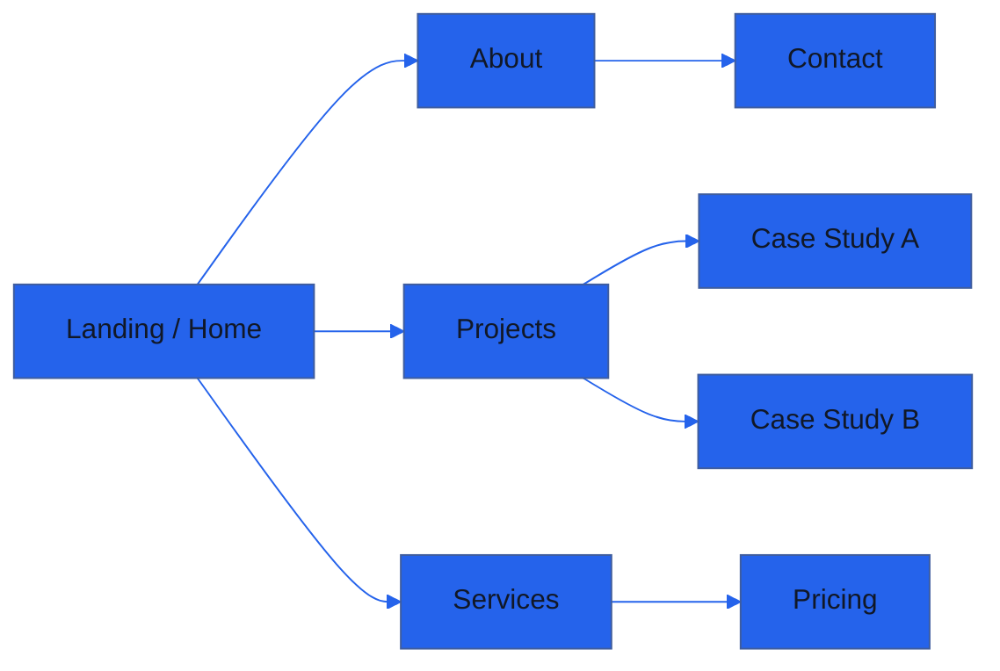

---
# Global deck settings
title: "Portfolio Website Showcase"
info: |
  Ocean Professional — Blue & Amber accents, minimalist, subtle gradients, rounded corners, and shadow details.
  Full-screen slides, navigation sidebar, and branded header/footer for a polished presentation.
class: text-left
mdc: true
transition: slide-left
fonts:
  sans: Inter, ui-sans-serif, system-ui, -apple-system, Segoe UI, Roboto, Helvetica Neue, Arial
  mono: ui-monospace, SFMono-Regular, Menlo, Monaco, Consolas, "Liberation Mono", "Courier New", monospace
css: |
  @import "./style.css";
layout:
  width: 1280
  height: 720
---

<!-- Header / Footer / Sidebar layout wrapper -->
<OceanFrame>

# Portfolio Website Showcase

  

    <h2 class="text-hero">Designing Trust with Clarity</h2>
    
A modern, performant portfolio that converts visitors into clients

    
by Your Name • your@email.com • yoursite.com

    

      <button class="btn-primary">View Live</button>
      <button class="btn-secondary">Case Study</button>
    

  

</OceanFrame>

---

<OceanFrame>

# Vision & Design Philosophy

  

    
Clarity

    <h3 class="feature-title">Minimal, Purposeful</h3>
    <ul class="points-clean">
      <li>Focus on essential content</li>
      <li>Whitespace for readability</li>
      <li>Typographic hierarchy</li>
    </ul>
  

  

    
Craft

    <h3 class="feature-title">Ocean Professional Theme</h3>
    <ul class="points-clean">
      <li>Primary blue (#2563EB) accents</li>
      <li>Amber (#F59E0B) highlights</li>
      <li>Subtle gradients and shadows</li>
    </ul>
  

  

    
Trust

    <h3 class="feature-title">Credibility Signals</h3>
    <ul class="points-clean">
      <li>Case studies & testimonials</li>
      <li>Clear CTAs across pages</li>
      <li>Accessible, responsive UI</li>
    </ul>
  

</OceanFrame>

---

<OceanFrame>

# Feature Highlights

  

    

      <h3 class="feature-title">Hero With Value Proposition</h3>
      
Clear headline, subcopy, primary CTA, and supporting proof.

    

    

      <h3 class="feature-title">Project Gallery</h3>
      
Filterable categories, rich thumbnails, quick case-study access.

    

    

      <h3 class="feature-title">Case Studies</h3>
      
Problem → Process → Outcome with metrics and visuals.

    

  

  

    

      
Mock: Hero section with blue gradient and CTA

    

  

</OceanFrame>

---

<OceanFrame>

# Experience & Flow

  

    
1.2s

    
Time to Interactive

  

  

    
98

    
Lighthouse Perf

  

  

    
AA

    
Accessibility

  

  

    

    

      
Step 1

      <h4>Landing → Hero</h4>
      <ul class="points-clean">
        <li>Headline + CTA</li>
        <li>Immediate credibility</li>
      </ul>
    

  

  

    

    

      
Step 2

      <h4>Projects → Case Study</h4>
      <ul class="points-clean">
        <li>Filter by type</li>
        <li>Outcome-focused stories</li>
      </ul>
    

  

  

    

    

      
Step 3

      <h4>Contact → Conversion</h4>
      <ul class="points-clean">
        <li>Short form</li>
        <li>Calendly integration</li>
      </ul>
    

  

</OceanFrame>

---

<OceanFrame>

# Information Architecture

  
Notes

  <ul class="points-clean">
    <li>Primary navigation persistent in header</li>
    <li>Active section highlighted in sidebar</li>
    <li>Footer includes socials and contact CTA</li>
  </ul>

</OceanFrame>

---

<OceanFrame>

# Visual Language

  

    
Color

    <h3 class="feature-title">Blue & Amber Accents</h3>
    <ul class="points-clean">
      <li>Primary: #2563EB</li>
      <li>Secondary: #F59E0B</li>
      <li>Error: #EF4444</li>
    </ul>
  

  

    
Surface

    <h3 class="feature-title">Light Surfaces</h3>
    <ul class="points-clean">
      <li>Background: #f9fafb</li>
      <li>Surface: #ffffff</li>
      <li>Text: #111827</li>
    </ul>
  

  

    
Details

    <h3 class="feature-title">Modern Minimalist</h3>
    <ul class="points-clean">
      <li>Rounded corners</li>
      <li>Soft drop shadows</li>
      <li>Subtle gradients</li>
    </ul>
  

</OceanFrame>

---

<OceanFrame>

# Components & Sections

  

    <h3 class="feature-title">Hero & CTAs</h3>
    
Prominent headline with primary actions to drive engagement.

  

  

    <h3 class="feature-title">Work Grid</h3>
    
Responsive gallery with hover states and quick previews.

  

  

    <h3 class="feature-title">Testimonial Band</h3>
    
Social proof with avatars, names, and outcomes.

  

  

    <h3 class="feature-title">Process</h3>
    
Discovery → Design → Develop → Deliver, with clear steps.

  

  

    <h3 class="feature-title">Contact</h3>
    
Short form, availability, and alternative channels.

  

  

    <h3 class="feature-title">Footer</h3>
    
Branding, navigation, and legal links.

  

</OceanFrame>

---

<OceanFrame>

# Benefits

  

    
+42%

    
Lead Conversion

  

  

    
-35%

    
Bounce Rate

  

  

    
+3x

    
Time on Site

  

  

    
A+

    
SEO Health

  

  

    
100%

    
Responsive

  

  

    
Fast

    
Edge Cached

  

</OceanFrame>

---

<OceanFrame>

# Case Study Snapshot

  

    

      
Client

      <h3 class="feature-title">Independent Designer</h3>
      <ul class="points-clean">
        <li>Needed higher-quality leads</li>
        <li>Wanted to showcase process and outcomes</li>
        <li>Required easy content updates</li>
      </ul>
    

    

      
Approach

      <ul class="points-clean">
        <li>Reworked information architecture</li>
        <li>Focused on benefits and outcomes</li>
        <li>Added case studies and testimonials</li>
      </ul>
    

  

  

    

      
Results

      <h3 class="feature-title">Measurable Impact</h3>
      <ul class="points-clean">
        <li>2.3x increase in qualified inquiries</li>
        <li>Shorter sales cycles</li>
        <li>Higher project values</li>
      </ul>
    

    

      
Before/After metrics chart

    

  

</OceanFrame>

---

<OceanFrame>

# Technology Stack

  

    
Frontend

    <ul class="points-clean">
      <li>Vue / React</li>
      <li>TypeScript</li>
      <li>Tailwind-like utility approach</li>
    </ul>
  

  

    
Backend

    <ul class="points-clean">
      <li>Static-first, Jamstack</li>
      <li>Edge deploy</li>
      <li>Content via Markdown / CMS</li>
    </ul>
  

  

    
Tooling

    <ul class="points-clean">
      <li>CI/CD to Netlify/Vercel</li>
      <li>Analytics & SEO tooling</li>
      <li>Automated image optimizations</li>
    </ul>
  

  

    
Performance

    <ul class="points-clean">
      <li>Code-splitting</li>
      <li>Lazy media</li>
      <li>Pre-rendered pages</li>
    </ul>
  

  

    
Accessibility

    <ul class="points-clean">
      <li>Keyboard navigable</li>
      <li>Color contrast checked</li>
      <li>ARIA where needed</li>
    </ul>
  

  

    
Security

    <ul class="points-clean">
      <li>Headers and CSP defaults</li>
      <li>Form validation</li>
      <li>Privacy-first analytics</li>
    </ul>
  

</OceanFrame>

---

<OceanFrame>

# Pricing Options

  

    
Starter

    <h3 class="feature-title">$799</h3>
    <ul class="points-clean">
      <li>1-page portfolio</li>
      <li>Basic SEO</li>
      <li>Launch support</li>
    </ul>
    <button class="btn-secondary mt-2">Get Started</button>
  

  

    
Popular

    <h3 class="feature-title">$2,499</h3>
    <ul class="points-clean">
      <li>Multi-page site</li>
      <li>Case study templates</li>
      <li>Analytics & SEO pack</li>
      <li>Performance tuning</li>
    </ul>
    <button class="btn-primary mt-2">Choose Plan</button>
  

  

    
Custom

    <h3 class="feature-title">From $5,000</h3>
    <ul class="points-clean">
      <li>Tailored design system</li>
      <li>CMS integration</li>
      <li>Advanced animations</li>
    </ul>
    <button class="btn-secondary mt-2">Contact</button>
  

</OceanFrame>

---

<OceanFrame>

# Testimonials

  

    
"The new portfolio elevated our brand instantly. Leads are better, conversations are easier."

    

      <strong>Alex Rivera</strong> 
      Founder, Clearline Studio
    

  

  

    
"Thoughtful design and excellent performance. Our time on page tripled."

    

      <strong>Maya Chen</strong> 
      Director, Vertex Labs
    

  

</OceanFrame>

---

layout: center
class: text-center
---

<OceanFrame noSidebar>

# Next Steps

  

    
Get Started Today

    <h2 class="text-hero">Let’s Craft a Compelling Portfolio</h2>
    
Clarity, credibility, and conversions—beautifully executed.

    

      <button class="btn-primary">Book a Call</button>
      <button class="btn-secondary">Download Brief</button>
    

  

  

    

      
Contact

      <ul class="points-clean">
        <li>Email: hello@yoursite.com</li>
        <li>Web: yoursite.com</li>
        <li>City: Remote / Worldwide</li>
      </ul>
      
© 2025 Your Name

    

  

Press S for presenter mode • Press E to open editor • Use arrow keys to navigate

</OceanFrame>
